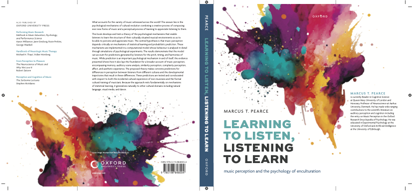

Pearce, M. T. (2025). <i>Learning to listen, listening to learn: Music perception and the psychology of enculturation.</i> Oxford University Press.

<h5>Availability</h5>

<ul>
  <li>Hardback available from <a href="https://global.oup.com/academic/product/learning-to-listen-listening-to-learn-9780198848004">Oxford University Press</a>.</li>
  <li>Hardback and e-book available from <a href="https://www.amazon.com/Learning-Listen-Listening-Learn-Enculturation/dp/0198848005">Amazon</a>.</li>
  
</ul>

<h5>Sample material</h5>

<ul>
  <li>Preview up to p. 32 (part way through Chapter 2) on <a href="https://www.google.co.uk/books/edition/Learning_to_Listen_Listening_to_Learn/t1RgEQAAQBAJ?gbpv=1">Google books</a>.</li>
  <li> The <a href="assets/papers/Pearce2025_LearningToListen_TableOfContents.pdf">table of contents</a>.</li>
  <li>The list of <a href="assets/papers/Pearce2025_LearningToListen_References.pdf">references</a>.</li>
</ul>

<h5>Audio examples</h5>

Figure 2.2 (p. 32): Melody from the chorales harmonised by J. S. Bach (BWV 379).

<audio src="assets/audio/Figure2.2_chorale151.ogg" controls>Your browser does not support the audio element.</audio>

   

Figure 3.1 (p. 76): Octet in F Major (D. 803), fourth movement, by Franz Schubert.

(a) mm. 1-2.

<audio src="assets/audio/Figure3.1_SchubertOctet-excerpt1.ogg" controls>Your browser does not support the audio element.</audio>

(b) mm. 21-22.

<audio src="assets/audio/Figure3.1_SchubertOctet-excerpt2.ogg" controls>Your browser does not support the audio element.</audio>

(c) mm. 23-24.

<audio src="assets/audio/Figure3.1_SchubertOctet-excerpt3.ogg" controls>Your browser does not support the audio element.</audio>

   

Figure 4.1 (p. 94): J. S. Bach, Cello Suite No. 3 (BWV 1009), Bourr&eacute;e, opening motif, mm. 0-2.

<audio src="assets/audio/Figure4.1_cs3-5bou-reduced.ogg" controls>Your browser does not support the audio element.</audio>

   

Figure 4.2 (p. 95): J. S. Bach, Cello Suite No. 4 (BWV 1010), Sarabande, opening motif, mm. 1-3.

<audio src="assets/audio/Figure4.2_cs4-4sar-reduced.ogg" controls>Your browser does not support the audio element.</audio>

   

Figure 4.3 (p. 97): The stimulus from Prince et al., (2009b) Experiments 1 and 2.

<audio src="assets/audio/Figure4.3_PrinceEtAl2009.ogg" controls>Your browser does not support the audio element.</audio>

   

Figure 4.4 (p. 105): A chord sequence adapted from Koelsch et al. (2002), Figure 1, transposed into G major.

<audio src="assets/audio/Figure4.4_harmony-example.ogg" controls>Your browser does not support the audio element.</audio>

   

Figure 4.5 (p. 106): Cadence types from W. A. Mozart’s keyboard sonatas (Sears et al., 2019).

(a): Perfect authentic cadence (K. 281, i, mm. 5-8).

<audio src="assets/audio/Figure4.5a_Sears2019_01.ogg" controls>Your browser does not support the audio element.</audio>

(b): Imperfect authentic cadence (K. 311, i, mm. 1-4).

<audio src="assets/audio/Figure4.5b_Sears2019_11.ogg" controls>Your browser does not support the audio element.</audio>

(c): Half cadence (K. 333, iii, mm. 60–64).

<audio src="assets/audio/Figure4.5c_Sears2019_23.ogg" controls>Your browser does not support the audio element.</audio>

(d): Deceptive cadence (K. 457, i, mm. 42–48).

<audio src="assets/audio/Figure4.5d_Sears2019_31.ogg" controls>Your browser does not support the audio element.</audio>

(e): Evaded cadence (K. 281, ii, mm. 96–99).

<audio src="assets/audio/Figure4.5e_Sears2019_35.ogg" controls>Your browser does not support the audio element.</audio>

   

Figure 5.2 (p. 134): Density 21.5 by Edgar Var&egrave;se.

<audio src="assets/audio/Figure5.2_MIDI-Varese-Density21_5.ogg" controls>Your browser does not support the audio element.</audio>

    

Figure 6.2 (p. 167): W. A. Mozart, Symphony No. 40 in G minor (K. 550), opening melody.

<audio src="assets/audio/Figure6.2_MozartSymphony40.ogg" controls>Your browser does not support the audio element.</audio>

   

<!-- 
Figure 6.4 (p. 173): Stimuli from an experiment by Hansen et al. (2021).

(a) BegLo12: Phrase initial target note, low entropy.

<audio src="assets/audio/Figure6.4a_BegLo12.ogg" controls>Your browser does not support the audio element.</audio>

(b) BegHi01: Phrase initial target note, high entropy.

<audio src="assets/audio/Figure6.4b_BegHi01.ogg" controls>Your browser does not support the audio element.</audio>

(c) EndLo05: Phrase final target note, low entropy (final note truncated).

<audio src="assets/audio/Figure6.4c_EndLo05_truncated.ogg" controls>Your browser does not support the audio element.</audio>

(d) EndHi06: Phrase final target note, high entropy (final note truncated).

<audio src="assets/audio/Figure6.4d_EndHi06_truncated.ogg" controls>Your browser does not support the audio element.</audio>

   -->

Figure 6.5 (p. 175): J. S Bach, Prelude 15 (BWV 884) from the Well-Tempered Clavier Book II (mm. 9-12).

<audio src="assets/audio/Figure6.5_Wtcii15a-excerpt.ogg" controls>Your browser does not support the audio element.</audio>

   

Figure 7.1 (p. 200): German and Chinese folk melodies illustrating cultural distance.

(a) German melody (deut1445) with greatest cultural distance from the Chinese corpus.

<audio src="assets/audio/Figure7.1_deut1445.ogg" controls>Your browser does not support the audio element.</audio>

(b) Chinese melody (han0418) with greatest cultural distance from the German corpus.

<audio src="assets/audio/Figure7.1_han0418.ogg" controls>Your browser does not support the audio element.</audio>

